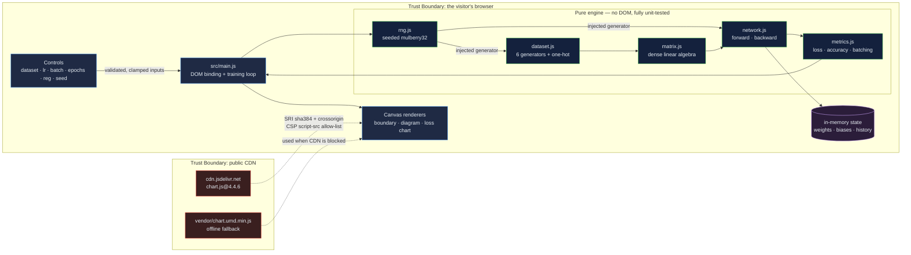

# Neural Network Playground: watch a network learn, one gradient step at a time

[](https://github.com/Freddricklogan/neural-network-playground/actions/workflows/deploy.yml)
[](#5-getting-started--verification)
[](https://github.com/Freddricklogan/neural-network-playground/actions/workflows/codeql.yml)
[](LICENSE)
[](https://freddricklogan.github.io/neural-network-playground/)

## 1. Executive Summary & Business Impact

**Problem statement.** Backpropagation is taught as an equation and experienced
as a black box. Learners adjust a learning rate, see a number move, and take on
faith that the two are connected. Framework tutorials make this worse: `model.fit()`
hides every mechanism the lesson is about.

**Solution & value delivered.** A neural network written from scratch — matrices,
activations, softmax cross-entropy, L1/L2 regularisation, mini-batch gradient
descent — with no ML framework, running entirely in the browser. Every
hyperparameter is a live control, and the decision boundary redraws as the
network trains, so cause and effect are visible in the same frame. Runs are
seeded, so an instructor can hand out a seed and every student reproduces the
identical run.

It is a **teaching instrument**, not a training platform: the datasets are
synthetic and the scale is deliberately small enough to watch.

**[→ Read the full case study](docs/CASE_STUDY.md)**

## 2. Demonstrated Competencies & Technical Skills

- **Systems Architecture & CS** — A layered design in which pure computation
  (`src/{rng,matrix,activation,network,dataset,metrics}.js`) never touches the
  DOM, and the DOM layer (`src/{main,charts}.js`) never computes. That boundary
  is what makes 100% statement coverage of the engine reachable at all.
- **Data Science & AI** — Feed-forward network with configurable depth and
  width; ReLU / tanh / sigmoid / linear activations; numerically stable softmax;
  categorical cross-entropy; L1 and L2 penalties; seeded Fisher–Yates mini-batch
  sampling. Six synthetic datasets spanning linear, radial and interleaved
  non-linear boundaries.
- **Cybersecurity & Compliance** — Strict `default-src 'none'` CSP; the one CDN
  dependency pinned to an exact version with an SRI hash computed against the
  artifact, plus a vendored offline fallback; no inline script, style or event
  handlers; CodeQL and Trivy in CI.
- **EdTech & Human-Centered Design** — Reproducible seeds for classroom parity,
  a five-step guided tour that performs real actions, `aria-live` on every
  changing metric, full keyboard reachability, and `prefers-reduced-motion`
  respected.

## 3. System Architecture & Data Flow



No network calls leave the page. There is no backend, no account and no telemetry.

## 4. Technical Highlights & Engineering Decisions

### ADR-1 — Broadcasting in `Matrix.add`, because the demo did not run without it

**Context.** `forward()` adds a `1 x n` bias to an `m x n` activation matrix.
The original `Matrix.add` demanded an exact shape match and threw
`Incompatible dimensions` otherwise. The UI ships a default batch size of 32.
Every click of **Train** therefore threw before a single gradient step — the
published demo was non-functional for any batch size except 1.

**Decision.** `add` broadcasts a single-row operand across every row, and still
rejects genuinely mismatched shapes. Broadcasting is what a bias add *means*;
the exact-match rule was never the right constraint.

**Consequence.** Training works at any batch size. Two regression tests pin both
halves — the broadcast and the still-rejected mismatch — and every training test
now uses multi-row batches, so the bug cannot return silently. See `AUDIT.md` §A1.

### ADR-2 — Injected randomness instead of a module-level generator

**Context.** A single mutable `let rng` was shared implicitly by dataset
generation, weight initialisation and batch sampling. Nothing could be tested in
isolation, and the "reproducible runs" the seed control promises could be broken
by any consumer pulling an extra number from the stream.

**Decision.** The generator is a value, created from a seed and passed in.
`Matrix.randomize(rng)` throws a `TypeError` if it is omitted.

**Consequence.** Every engine module is independently testable, and seeded
reproducibility is enforced by tests rather than hoped for. The cost is a
slightly wider signature on four functions — a good trade.

### ADR-3 — Pin the CDN and vendor a fallback, rather than trust "latest"

**Context.** The page loaded `https://cdn.jsdelivr.net/npm/chart.js` with no
version, no `integrity` and no `crossorigin` — executing whatever bytes the CDN
served at load time. It also called `new Chart(...)` unconditionally, so a
blocked CDN threw and aborted rendering.

**Decision.** Pin `chart.js@4.4.6`, compute the SRI hash from the downloaded
artifact, vendor a byte-identical copy, and have `loadChartLib()` fall back to it
— then degrade to a visible notice if both fail.

**Consequence.** A strict CSP became possible, the supply-chain risk is bounded
by a hash, and the demo still works offline and on locked-down networks. The
vendored copy adds ~200 KB to the repository, which is the price of the guarantee.

## 5. Getting Started & Verification

**Prerequisites.** Node 22 LTS (or any Node ≥ 20). No build step — the page runs
directly from source.

```bash
git clone https://github.com/Freddricklogan/neural-network-playground.git
cd neural-network-playground
npm install
npm run serve          # then open the printed URL
```

**Verification — these are the numbers this repository actually produced:**

```bash
npm test        # Test Files 6 passed (6) · Tests 81 passed (81)
npm run coverage # All files 100% statements
npm run lint     # eslint . — clean
npm run validate # html-validate index.html — clean
```

| Check | Result |
| --- | --- |
| Unit tests | **81 passed / 81** across 6 files |
| Statement coverage (engine) | **100%** |
| ESLint | clean |
| html-validate | clean |
| Headless Chrome smoke | **0 console errors**; tour opens; training reached epoch 56 at 99.67% accuracy on the default seed |

Coverage is measured over the pure engine. `src/main.js`, `src/charts.js` and
`src/exec-shell.js` are DOM-binding layers excluded from the coverage target and
covered by the browser smoke test instead.

## 6. Live Demo & Production Showcase

**<https://freddricklogan.github.io/neural-network-playground/>**

No account, no credentials, no backend — everything runs in your browser.

**30-second guided walkthrough.** Press **Take the 30-second tour** in the
header; each of the five steps performs the action it describes.

1. **Pick a problem** — loads the *Moons* dataset, one of the two genuinely
   non-linear boundaries.
2. **Shape the network** — widens the hidden layer to 12 neurons and rebuilds.
3. **Train it** — starts mini-batch gradient descent; the boundary bends as loss falls.
4. **Read the boundary** — shading is the network's confidence across the input
   space; dots are the training points.
5. **Take it with you** — exports architecture, weights and hyperparameters as
   JSON. The run is seeded, so it reproduces exactly.

Prefer to drive it yourself: set **Seed** to any integer and two runs with
identical settings produce identical results — useful for handing a class a
single reproducible experiment.

> **Deployment note.** Pages serves `index.html` from the repository root via
> `.github/workflows/deploy.yml`. **Settings → Pages → Source must be set to
> "GitHub Actions"** for the workflow to publish.
